<p align="center">
  
</p>

<h2 align="center">🔗 TurtlPass Ecosystem</h2>

<p align="center">
  🐢 <a href="https://github.com/TurtlPass/turtlpass-firmware-arduino"><b>Firmware</b></a> •
  💾 <a href="https://github.com/TurtlPass/turtlpass-protobuf"><b>Protobuf</b></a> •
  💻 <a href="https://github.com/TurtlPass/turtlpass-python"><b>Host</b></a> •
  🌐 <a href="https://github.com/TurtlPass/turtlpass-chrome-extension"><b>Chrome</b></a> •
  📱 <a href="https://github.com/TurtlPass/turtlpass-android"><b>Android</b></a>
</p>

---

# 📱 TurtlPass Android

[](https://github.com/TurtlPass/turtlpass-android/releases/latest "GitHub Release")


[](https://developers.google.com/protocol-buffers "Protocol Buffers")
[](#)
[](https://opensource.org/licenses/MIT "License: MIT")

A secure, hardware-backed password generator that connects your Android phone to the TurtlPass USB device via Serial & Protobuf.  
User-specific inputs are prepared and hashed on the phone, while the final password is derived inside the TurtlPass hardware using a device-protected secret.  
When you press the physical button, the device emulates a keyboard and types your password — safely and locally, without ever exposing it online.

---

## ⚡ Features

* 🔒 **Hardware-backed password generation**  
  Passwords are derived and typed by the TurtlPass USB device — never stored or exposed on the phone.

* 📱 **App-based password selection**  
  Generate passwords per installed Android app, with manual selection or automatic foreground detection.

* 🌐 **Website-based password selection**  
  Generate passwords per domain, with support for manual selection, browser detection, or URL sharing.

* 👤 **Account ID management**  
  Automatically retrieves Android accounts (with permission), remembers previous selections, and allows manual override at any time.

* 🔐 **Secure PIN entry & biometric unlock**  
  Enter your PIN using a secure keypad, optionally store it encrypted, and unlock it later using fingerprint authentication.

* ⚡ **Automatic context detection (optional)**  
  With Usage Access and Accessibility enabled, TurtlPass can detect the current app or website and pre-select it for you.

* ⌨️ **One-button password typing**  
  No clipboard. No copy/paste. The device types the password directly via USB HID.

---

## ⬇️ Installation

[](https://github.com/TurtlPass/turtlpass-android/releases)
[](./OBTAINIUM.md)

To verify that the APK was signed by the official TurtlPass release key:

- **Package ID:** `com.turtlpass`
- **Verify signing certificate:**
  ```bash
  $ apksigner verify --print-certs turtlpass-vX.X.X.apk
  ```

- **Signing certificate SHA-256:**
  ```
  2521eddb9ce3b4cb55d65b74d15d1c2d7fa58bf35b6fc7727bede107c7a8b1bc
  ```

  > This signing certificate is stable across official releases.  
  > Any APK not matching this fingerprint should be considered unofficial.

---

## 🚀 Usage

1. Select an **App or Website**
2. Choose or enter your **Account ID**
3. Tap **Get Password** and enter your PIN
4. Connect the TurtlPass USB device
5. Press the **device button** to type the password securely

---

## 🧭 How Password Selection Works

TurtlPass generates a unique password using a hardware-protected secret seed combined with three user-specific inputs:

**(App or Website) + Account ID + PIN**


### 📱 App selection

You can choose an Android app in three ways:

#### 1️⃣ Installed apps list

Browse and search all installed apps manually.

<a href="assets/videos/app-installed.mp4" target="_blank">
    
</a>

#### 2️⃣ Recently used apps *(requires Usage Access)*

Quickly select from apps you've used most recently.

#### 3️⃣ Automatic foreground detection *(requires Accessibility)*

When a TurtlPass device is plugged in, the app currently in the foreground is automatically detected and shown in a bottom sheet for quick confirmation.

<a href="assets/videos/app-foreground.mp4" target="_blank">
    
</a>


### 🌐 Website / domain selection

Websites can also be selected in three ways:

#### 1️⃣ Websites list

Manually pick a domain.

<a href="assets/videos/web-list.mp4" target="_blank">
    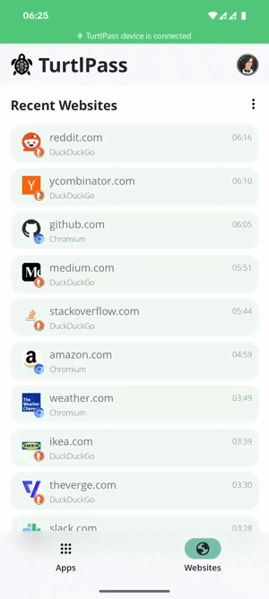
</a>

#### 2️⃣ Automatic browser detection *(requires Accessibility)*

When a browser is in the foreground, TurtlPass detects the current domain and presents it in a bottom sheet.

<a href="assets/videos/web-browser.mp4" target="_blank">
    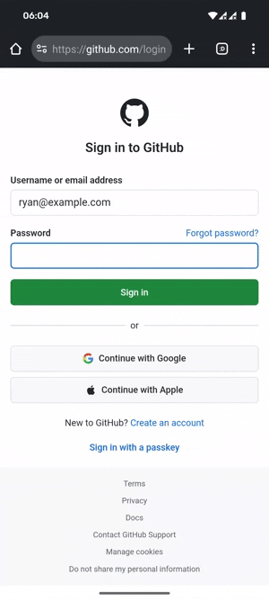
</a>

#### 3️⃣ Share URL to TurtlPass

Share a link from any app (typically a browser) directly to TurtlPass to select that domain instantly.

<a href="assets/videos/web-share.mp4" target="_blank">
    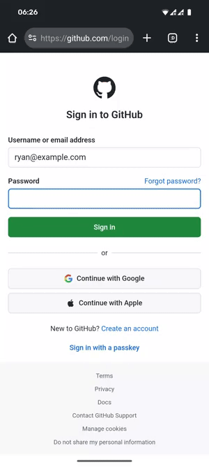
</a>

Recently detected domains are stored and shown under **Recent Websites** when Accessibility is enabled.


### 👤 Account ID selection

- Android accounts (email addresses) are automatically retrieved with permission
- The last selected account is remembered and pre-selected next time
- You can always enter **any Account ID manually**, regardless of stored accounts


### 🔢 PIN handling

- The PIN is entered via a secure on-screen keypad
- Optionally stored encrypted on-device
- Can be unlocked later using fingerprint authentication

---

## 🔐 Cryptographic Workflow (App ↔ Device)

The Android app prepares all user-specific inputs locally.
Before transmission, the selected app or domain, account ID, and PIN are combined and hashed on the phone using Argon2.

The resulting hash is sent to the TurtlPass device over USB, where it is combined with a device-specific, hardware-protected secret seed.
The device then derives the final password and types it securely via USB HID.

The Android app never **sees, stores, or derives the generated password**.

```
+-------------------+     Protobuf over USB     +------------------------+
|    Android App    |  <--------------------->  |    TurtlPass Device    |
|-------------------|                           |------------------------|
| Argon2id hash of: |    Serialised Commands:   | Secret Seed (Hardware) |
|  • App / Domain   |   → genPassword(hash) →   |   + Input Hash         |
|  • Account ID     |    ← isSuccess(bool) ←    |   → KDF                |
|  • PIN            |                           | Types via USB HID      |
+-------------------+                           +------------------------+
          |                                                   |
          └──────< Password typed via HID keyboard <──────────┘
```

---

## 🔍 Threat Model

TurtlPass defends against the following threats:

- **Compromised Android apps** attempting to read or intercept generated passwords
- **Clipboard snooping**, keylogging, or accessibility abuse by other apps
- **Malicious or compromised host devices** attempting to extract passwords
- **Replay or interception** of USB communication containing user inputs
- **Offline password recovery** from intercepted or logged data

---

## 🛡️ Security Guarantees & Non-Goals

### Security Guarantees

TurtlPass provides the following guarantees:

- **Passwords are never stored** on the Android device.
- **Passwords are never transmitted** over USB or any other interface.
- **Raw user inputs** (App/Domain, Account ID, PIN) are never sent to the device.
- All user inputs are **one-way hashed using Argon2id** before transmission.
- The final password derivation always occurs **inside the TurtlPass hardware** using a device-specific secret seed.
- Password entry is performed via **USB HID typing**, avoiding clipboard exposure.
- The same inputs will always generate the same password on the same device.

### Non-Goals

TurtlPass intentionally does **not** aim to:

- Synchronize passwords across devices
- Provide cloud storage or remote backup
- Replace full-featured password managers
- Hide user activity from the operating system or network provider

---

## 📦 Module Architecture

TurtlPass Android uses a scalable multi-module setup aligned with Clean Architecture.
Each module has a clearly defined responsibility to ensure testability, faster builds, and strict separation of concerns.

### **Core Modules**

* **core-ui**: Shared Compose components
* **core-di**: Global Hilt bindings
* **core-domain**: Shared Kotlin logic
* **core-model**: Shared Kotlin data models
* **core-db**: Local persistence layer
* **core-network**: Networking layer

### **Feature Modules**

* **feature-useraccount**: Account ID management and related UI.
* **feature-appmanager**: Installed app listing, filtering, and lookup.
* **feature-urlmanager**: Website handling and related UI.
* **feature-accessibility**: Accessibility for App/URL detection.
* **feature-biometric**: Biometric authentication UI + logic.
* **feature-usb**: USB Serial + Protobuf communication with the TurtlPass device.

This structure combines vertical features with horizontal core layers, keeping the codebase clean, maintainable, and easy to extend.

---

## 🏛️ Clean Architecture

* [Kotlin](https://kotlinlang.org/), [Coroutines](https://github.com/Kotlin/kotlinx.coroutines), [Flow / StateFlow](https://kotlinlang.org/docs/flow.html)
* [MVVM](https://developer.android.com/topic/libraries/architecture/viewmodel), [Use Cases](https://developer.android.com/topic/architecture/domain-layer#use-cases-kotlin), [Repositories](https://developer.android.com/topic/architecture#data-layer)
* [Hilt Dependency Injection](https://developer.android.com/training/dependency-injection/hilt-android)
* [Jetpack Compose UI](https://developer.android.com/jetpack/androidx/releases/compose-ui)
* [Navigation Compose](https://developer.android.com/jetpack/compose/navigation)

---

## 🧰 Troubleshooting

If you're unable to **Allow Usage Access** or **Enable Accessibility Access**, Android may be blocking these permissions under *restricted settings*.

### Allow restricted settings

1. Open **Settings → Apps**
2. Select **TurtlPass**
3. Tap the **three-dot (⋮) menu** in the top-right corner
4. Choose **“Allow restricted settings”**

<table border="0">
 <tr>
    <td><b style="font-size:30px">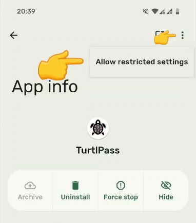</b></td>
 </tr>
 <tr>
    <td>Allow restricted settings</td>
 </tr>
</table>

> This is required for Usage Access and Accessibility permissions to function correctly on some Android versions.

---

## 📚 Dependencies

**Third-party libraries used in the project:**

[Hilt](https://dagger.dev/hilt/), [Coil](https://github.com/coil-kt/coil), [OkHttp](https://github.com/square/okhttp), [UsbSerial](https://github.com/felHR85/UsbSerial), [Argon2](https://github.com/lambdapioneer/argon2kt), [Lottie](https://github.com/airbnb/lottie-android), etc.

**Libraries used in the Unit Tests:**

[JUnit](https://junit.org/junit5/), [Mockk](https://github.com/mockk/mockk),  [Truth](https://github.com/google/truth) & [Turbine](https://github.com/cashapp/turbine)

---

## 📸 Screenshots

|               #               |               #                |               #               |               #               |
|:-----------------------------:|:------------------------------:|:-----------------------------:|:-----------------------------:|
| 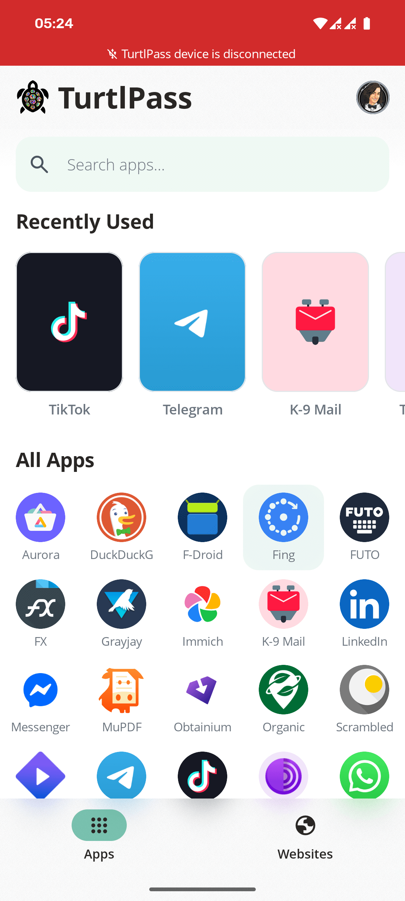 | 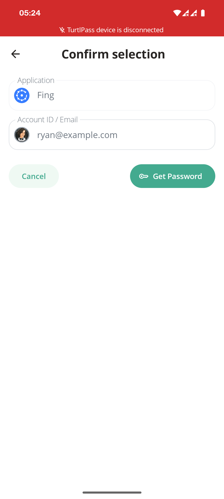  | 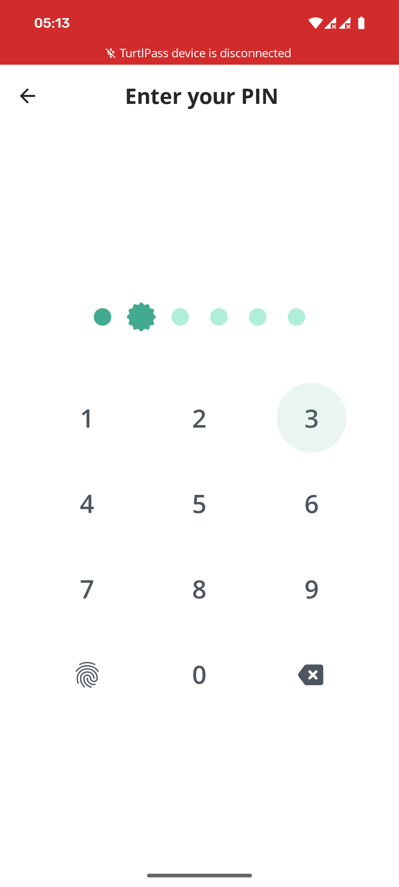 | 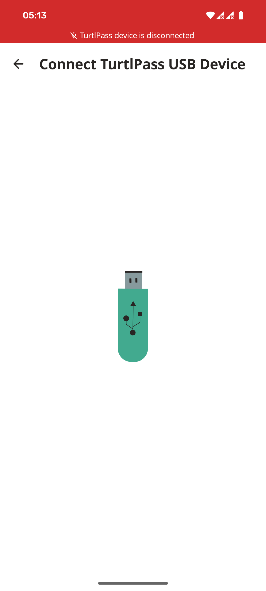 |
| 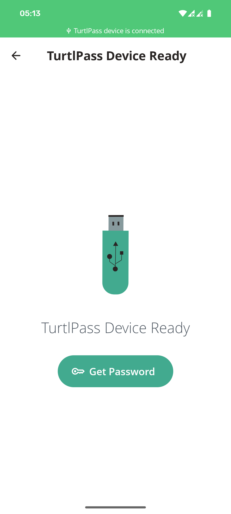 | 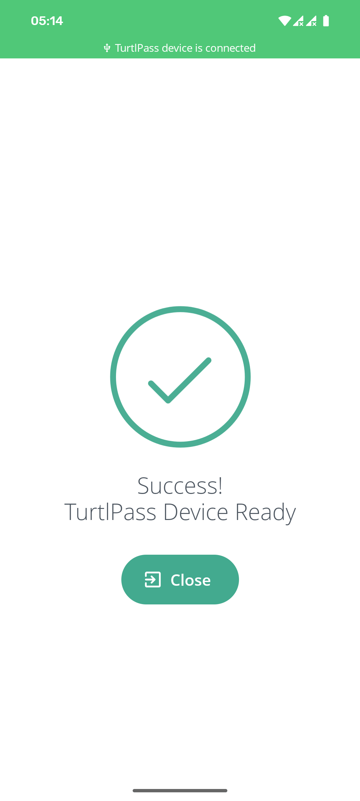  | 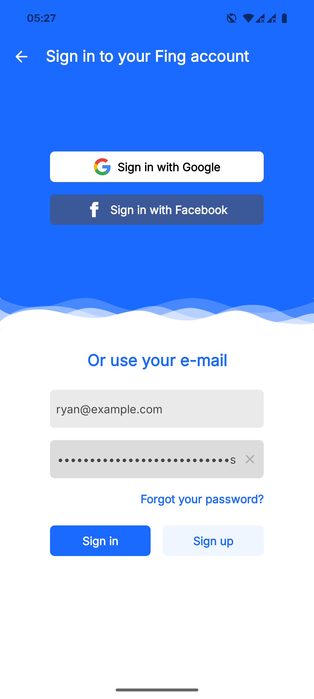 |                               |
| 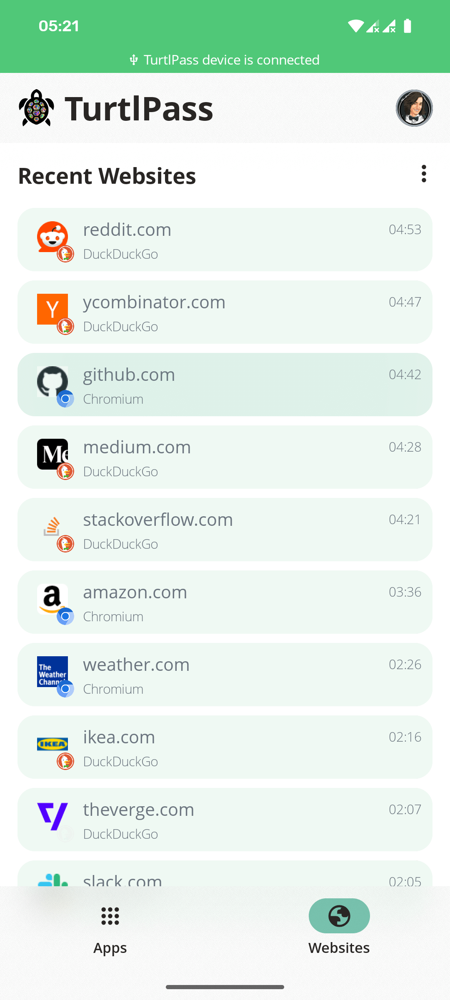 | 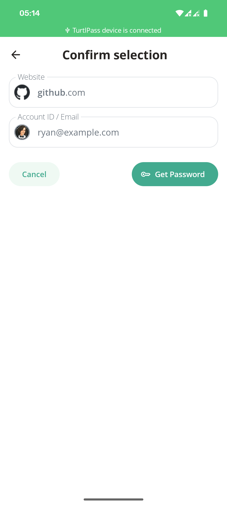 | 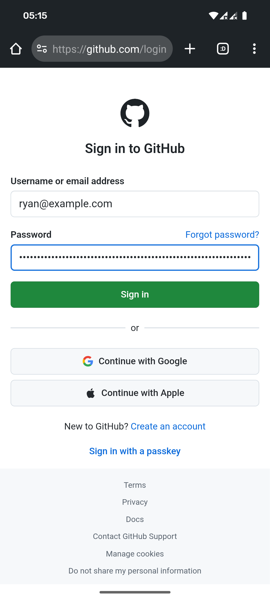 |

---

## 📜 License

This repository is licensed under the [MIT License](./LICENSE).
