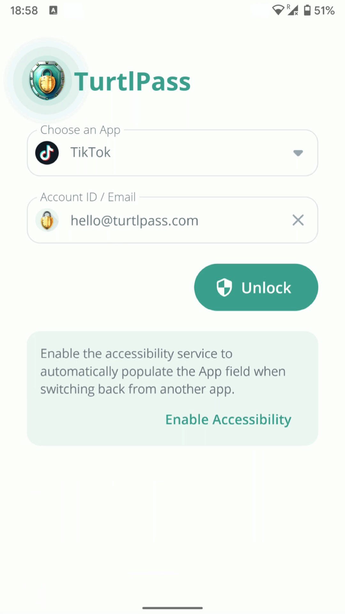

<h3 align="center">TurtlPass Android</h3>

TurtlPass Android sends a hash of the user's inputs (App Domain, Account ID, and PIN) to the TurtlPass Firmware via USB connection. When the physical button on the device is pressed, the firmware emulates an external keyboard and types the generated password.

## ⚡ Features

* Easy app selection: Choose the app you want to generate a password for from the list of installed apps on your device.
* Gravar integration: Load image associated to the user account when the account doesn't have a contact photo already.
* Communication with hardware: Use the TurtlPass firmware device to communicate with the app via USB serial port.
* Secure password generation: The TurtlPass device generates unique, secure passwords using the HKDF algorithm and a seed stored in the flash memory.
* Automatic typing: Don't worry about remembering or typing your passwords - TurtlPass device will do it for you!
* User-friendly design: Enjoy a smooth and intuitive user experience.

## 🔑 How to Use

1. Plug the TurtlPass device into your phone's USB port & enable USB connections
2. Choose the App you want a password for
3. Type in your Account ID, typically your email address
4. Click `Unlock` & type in your 6-digit PIN
6. (TurtlPass device generates your password)
7. Now press the button on the TurtlPass device to have it type your password

## 🏛️ Clean Architecture

* [Kotlin](https://kotlinlang.org/)
* [MVVM](https://developer.android.com/topic/libraries/architecture/viewmodel)
* [Use Cases](https://developer.android.com/topic/architecture/domain-layer#use-cases-kotlin)
* [Repositories](https://developer.android.com/topic/architecture#data-layer)
* [Dependency Injection](https://developer.android.com/training/dependency-injection/hilt-android)
* [Coroutines](https://github.com/Kotlin/kotlinx.coroutines)
* [Flow & StateFlow](https://kotlinlang.org/docs/flow.html)
* [Compose UI](https://developer.android.com/jetpack/androidx/releases/compose-ui)
* [Navigation](https://developer.android.com/jetpack/compose/navigation)

**Third-party libraries used in the project:**

[Hilt](https://dagger.dev/hilt/), [Coil](https://github.com/coil-kt/coil), [OkHttp](https://github.com/square/okhttp), [UsbSerial](https://github.com/felHR85/UsbSerial), [Lottie](https://github.com/airbnb/lottie-android), etc.

**Libraries used in the Unit Tests:**

[JUnit](https://junit.org/junit5/), [Mockk](https://github.com/mockk/mockk),  [Truth](https://github.com/google/truth) & [Turbine](https://github.com/cashapp/turbine)

## 🔮 Future improvements

* Add support for Browser Apps
* Read NDEF message ID from an external NFC Tag
* Hash user inputs with Argon2 instead of SHA-512

## 📦 Lottie Animations

* [USB Memory Stick Animation](https://lottiefiles.com/20358-usb-memory-stick-animation)
* [Loading/Success/Error Animation](https://lottiefiles.com/627-loading-success-failed)

## 📸 Screenshots

| # | # | # | # |
| :---: | :---: | :---: | :---: |
|  |  |  |  |
|  |  |  |  |

## 📄 License

TurtlPass Android is released under the [MIT License](https://github.com/TurtlPass/turtlpass-android/blob/master/LICENSE).
